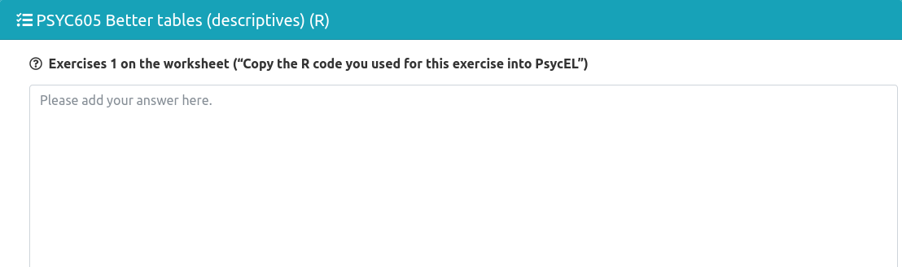

```{r setup, include=FALSE}
options(htmltools.dir.version = FALSE)
```

class: middle left inverse

```{r, include = FALSE}
library(emo)
library(fontawesome)
```


# Sessions

* 🔢 [Better Tables](https://www.andywills.info/rminr/better-tables.html)
* 📊 [Better Graphs](https://www.andywills.info/rminr/better-graphs.html)

---

class: top left inverse

# Better Tables: Session

.pull-left[

## Why R?

* Reproducible tables
* Reduces the chance of making an error
* Make changes effortlessly
* Supports all formats

]

.pull-right[

## Worksheet

* [Click on me to get to the worksheet 📝](https://www.andywills.info/rminr/better-tables.html)
* Try to solve errors.
* If anything is unclear on the worksheet - do let me know
* Explore what R can do. Check out the articles in the Footnote below.

]

.footnote[
#### Interesting Articles

.bold[*] Malcolm Barrett: [Replicating a New York Times Table of Swedish COVID-19 deaths with gt](https://malco.io/2020/05/16/replicating-an-nyt-table-of-swedish-covid-deaths-with-gt/)

.bold[*] David Keyes: [How to Make Beautiful Tables in R](https://rfortherestofus.com/2019/11/how-to-make-beautiful-tables-in-r/)

.bold[*] Tom Mock: [Mockup Blog Rules of Tables](https://themockup.blog/posts/2020-09-04-10-table-rules-in-r/)

.bold[*] Ana Voronkova: [Top and bottom 5 UK areas by pet population](https://github.com/Anavoron/Rstudio-table-contest-2020)
]

---

class: top left inverse

# Better Tables: Assessment

PASS/FAIL (optional) assessment in the form of a PSYC:EL task.

1. Copy-paste the code you used in Exercise 1.
2. Copy-paste the code you used in Exercise 2.



---

class: top left inverse

# Better Graphs: Session

<br><br><br><br>

> Modern data graphics can do much more than simply substitute for small statistical
> tables. At their best, graphics are instruments for reasoning about quantitative
> information. Often most effective way to describe, explore, and summarise a set of
> numbers - even a very large set - is to look at pictures of those numbers<sup>[1]</sup>

<br><br>

.footnote[
.bold[[1]] Tufte, E. R. (1985). The visual display of quantitative information. The Journal for Healthcare Quality (JHQ), 7(3), 15.
]

---

class: top left inverse

# Better Graphs: Session

.pull-left[

## Why R?

* Reproducible figures
* High-quality figures
* Changes are preserved
* Reduces chances of errors

]

.pull-right[

## Worksheet

* [Click on me to get to the worksheet 📝](https://www.andywills.info/rminr/better-graphs.html)
* Try to solve errors.
* Play around with the graphs. Look up some tutorials online and try out some new
  color palette or themes.
* If anything is unclear on the worksheet - do let me know

]

.footnote[
#### Interesting Articles


.bold[*] Library of examples of great figures: [R Graph Gallery](https://www.r-graph-gallery.com/)

.bold[*] Tom Mock: [A deep dive into {ggplot2} themes and making beautiful graphics in R](https://themockup.blog/static/slides/intro-plot.html#1)

.bold[*] [Quick Reference Guide](https://www.mit.edu/~amidi/teaching/data-science-tools/study-guide/data-visualization-with-r/) for some basic `ggplot` functionality

]

---

class: top left inverse

# Better Graphs: Assessment

PASS/FAIL (optional) PSYC:EL task.


---

class: top left inverse

# The End

`r emo::ji("email")` lenard.dome@plymouth.ac.uk

* `r emo::ji("chart")` Slides are availabe at [lenarddome.github.io/teaching](https://lenarddome.github.io/teaching/)
* `r emo::ji("notebook")` All other material, including notes, can be found on [GitHub](https://github.com/lenarddome/better-graphs-tables)
